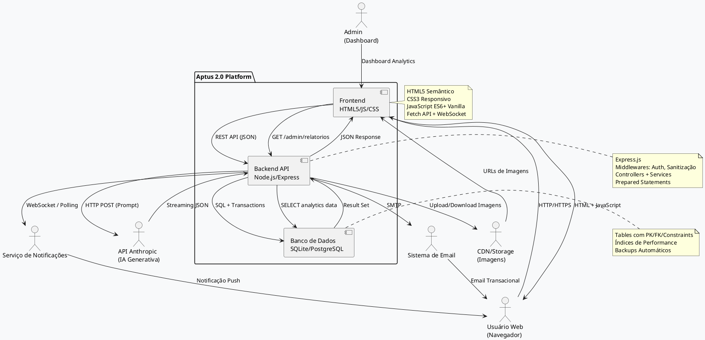
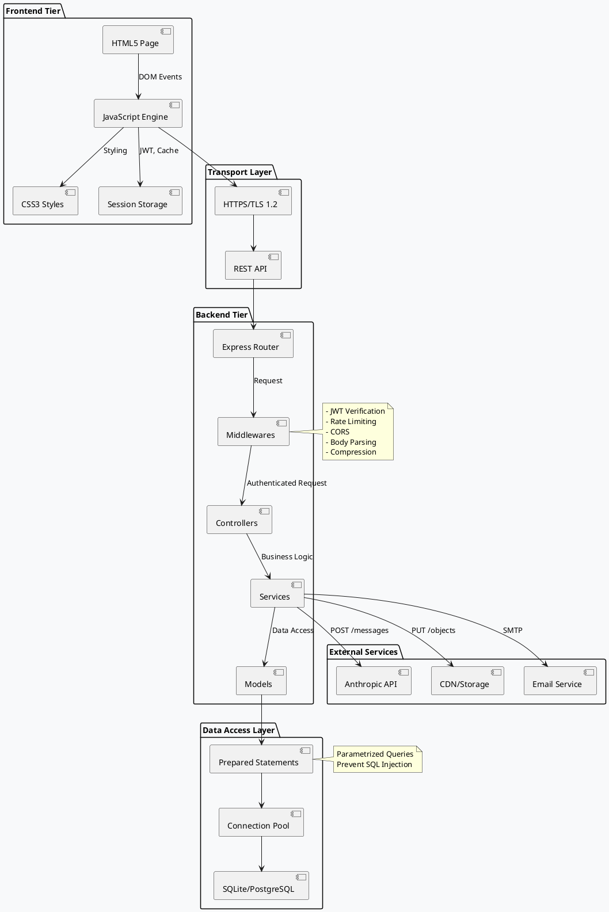
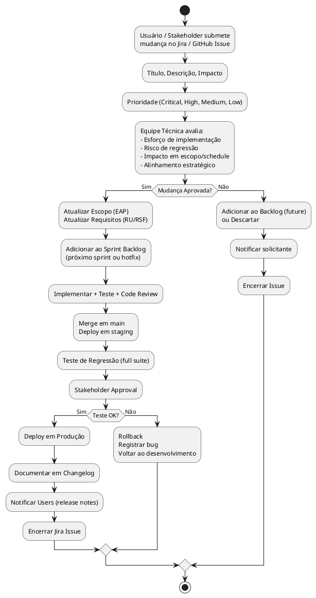

# 🎯 Especificação de Escopo do Projeto (PMBOK 7ª Ed. + UML 2.5.1)

**Projeto**: Aptus 2.0 - Rede Social de Emagrecimento Saudável  
**Versão**: 2.0.1  
**Data**: Setembro 2026  
**Padrões**: PMBOK 7ª Edição | UML 2.5.1 | ISO/IEC/IEEE 29148:2018  
**Elaborado por**: Escritório de Projetos (PMO)  

---

## 1. JUSTIFICATIVA DE ENGENHARIA E OBJETIVOS SMART

### 1.1 Justificativa Estratégica

**Contexto do Problema**:
- Crescimento de 45% ao ano na busca por aplicações de bem-estar/saúde
- Fragmentação de soluções: falta plataforma integrada com comunidade + nutricionista + IA
- Gap no mercado brasileiro: nenhuma rede social especializada em emagrecimento saudável

**Solução Proposta**:
Aptus 2.0 é uma plataforma Full Stack que consolida:
1. **Rede Social de Apoio**: Compartilhamento de jornada, comunidade engajada
2. **Orientação Nutricional**: Planos personalizados (manual + IA generativa)
3. **Rastreamento Inteligente**: Histórico de peso, consumo de refeições, exercícios
4. **Comunidade de Confiança**: Grupos de apoio, chats privados, moderação ativa

**Diferenciais Técnicos**:
- Backend scalável em Node.js com pool de conexões otimizado
- Frontend HTML5 semântico com validação client-side robusta
- Banco de dados relacional (SQLite dev / PostgreSQL prod) com constraints ACID
- Integração com IA (Anthropic Claude) para geração de planos inteligentes
- Autenticação stateless (JWT) para escalabilidade horizontal

---

### 1.2 Objetivos SMART da Solução

| Objetivo | SMART Desdobramento | Métrica de Sucesso |
|----------|---------------------|-------------------|
| **Funcionalidade** | Implementar 100% dos casos de uso principais (8 CUs) | Release 2.0 com todos CUs testados |
| **Segurança** | Zero vulnerabilidades críticas (OWASP Top 10) | Teste de penetração bem-sucedido |
| **Performance** | 95% das requisições < 200ms | Monitoramento APM contínuo |
| **Escalabilidade** | Suportar 1000+ usuários simultâneos | Teste de carga em staging |
| **Confiabilidade** | Uptime 99.5% em produção | SLA monitorado 24/7 |
| **Qualidade de Código** | 80%+ cobertura de testes unitários | Jest coverage report |
| **Documentação** | Documentação técnica completa (UML, API, arquitetura) | Entregáveis em markdown |

---

## 2. DIAGRAMA DE CONTEXTO (SYSTEM BOUNDARY)



---

## 3. ESCOPO DO PRODUTO - MÓDULOS ARQUITETURAIS

### 3.1 Divisão por Módulos e Entregáveis

#### **MÓDULO 1: Autenticação & Perfil**

**Descrição**: Gerenciamento de contas, sessões e dados pessoais.

**Entregáveis Físicos**:
- `frontend/js/auth.js` - Gerência de JWT local
- `api/src/rotas/usuarioRotas.js` - Endpoints /usuarios/cadastro, /login
- `api/src/controladores/usuarioControlador.js` - Lógica de negócio
- `api/src/middlewares/autenticacao.js` - Validação JWT
- `frontend/paginas/login.js` - UI de login
- `frontend/paginas/cadastro.js` - UI de cadastro
- `frontend/paginas/perfilBasico.js` - Edição de perfil
- `api/src/config/conexaoBanco.js` - Schema tabela usuarios

**Funcionalidades**:
- ✅ Registro de novo usuário (email, senha, dados pessoais)
- ✅ Login com email/senha + JWT
- ✅ Edição de perfil (peso, altura, bio, foto)
- ✅ Visualização de perfil público
- ✅ Logout + destruição de token
- ✅ Recuperação de senha (placeholder para future)

---

#### **MÓDULO 2: Feed & Posts**

**Descrição**: Compartilhamento de progresso e interação comunitária.

**Entregáveis Físicos**:
- `api/rotas/postRotas.js` - Endpoints CRUD de posts
- `api/controladores/postControlador.js` - Lógica de posts
- `frontend/paginas/criarPost.js` - UI de criação
- `frontend/paginas/feed.js` - Timeline social
- `frontend/componentes/cardPost.js` - Card reutilizável
- `frontend/componentes/toast.js` - Notificações visuais
- Schema: `posts_usuarios`, `comentarios_posts`, `curtidas_posts`

**Funcionalidades**:
- ✅ Criar post com texto + imagem (compressão automática)
- ✅ Listar feed paginado de seguidores
- ✅ Curtir post (toggle)
- ✅ Comentar post com validação
- ✅ Deletar próprio post (soft delete)
- ✅ Filtrar por tipo (progresso, receita, exercício, motivação, antes/depois)

---

#### **MÓDULO 3: Receitas**

**Descrição**: Catálogo de receitas saudáveis com avaliações.

**Entregáveis Físicos**:
- `api/rotas/receitasRotas.js` - Endpoints de receitas
- `api/controladores/receitaControlador.js`
- `frontend/paginas/planoAlimentar.js` - Browser de receitas
- `frontend/componentes/cardRefeicao.js` - Card de receita
- Schema: `receitas`, `comentarios_receitas`, `usuarios_salvam_receitas`

**Funcionalidades**:
- ✅ Listar receitas com paginação + filtros (categoria, calorias, alérgenos)
- ✅ Visualizar detalhes (ingredientes, modo de preparo, macros)
- ✅ Avaliar receita (1-5 estrelas + comentário)
- ✅ Salvar receita em favoritos
- ✅ Nutricionista criar receita validada
- ✅ Admin moderar receitas inapropriadas

---

#### **MÓDULO 4: Planos Alimentares**

**Descrição**: Planos nutricionais personalizados (manual e IA).

**Entregáveis Físicos**:
- `api/rotas/planoRotas.js` - Endpoints /planos
- `api/controladores/planoControlador.js`
- `api/servicos/iaServico.js` - Integração Anthropic
- `frontend/paginas/detalhePlano.js` - Visualização plano
- Schema: `planos_alimentares`, `planos_receitas_detalhado`, `planos_gerados_ia`

**Funcionalidades**:
- ✅ Nutricionista criar plano manual
- ✅ IA gerar plano automático (prompt → Claude → JSON)
- ✅ Usuário seguir plano
- ✅ Rastrear consumo de receitas do plano (checklist)
- ✅ Calcular macros e calorias totais
- ✅ Relatório de aderência ao plano

---

#### **MÓDULO 5: Exercícios**

**Descrição**: Guia de exercícios com técnica e progressão.

**Entregáveis Físicos**:
- `api/rotas/exerciciosRotas.js` - Endpoints exercícios
- `api/controladores/exercicioControlador.js`
- `frontend/paginas/medalhas.js` - Exercícios + conquistas
- Schema: `exercicios`, `historico_exercicios_usuario`, `curtidas_exercicios`

**Funcionalidades**:
- ✅ Listar exercícios por dificuldade/músculo
- ✅ Visualizar vídeo + técnica correta
- ✅ Registrar execução de exercício (séries, repetições, peso)
- ✅ Histórico de progressão
- ✅ Curtir/Salvar exercício
- ✅ Análise IA de forma (future: processamento de vídeo)

---

#### **MÓDULO 6: Rastreamento & Analytics**

**Descrição**: Histórico de peso, consumo, exercícios com visualizações.

**Entregáveis Físicos**:
- `api/rotas/analiticsRotas.js` - Endpoints de dados
- `api/controladores/analiticsControlador.js`
- `frontend/paginas/dashboard.js` - Gráficos pessoais
- Schema: `historico_peso`, `historico_consumo_usuario`, `historico_exercicios_usuario`

**Funcionalidades**:
- ✅ Registrar peso diário com histórico
- ✅ Gráfico de tendência (últimos 30/90/365 dias)
- ✅ Dashboard com KPIs (perda kg/semana, aderência plano, exercícios realizados)
- ✅ Exportar dados em CSV/PDF
- ✅ Notificações de milestone (perdeu 5kg, 30 dias seguidos, etc)

---

#### **MÓDULO 7: Comunicação Social**

**Descrição**: Chat privado, grupos de suporte e menções.

**Entregáveis Físicos**:
- `api/rotas/chatRotas.js` - Endpoints de mensagens
- `api/rotas/gruposRotas.js` - Endpoints de grupos
- `api/controladores/chatControlador.js`
- `frontend/paginas/chat.js` - Interface de chat
- Schema: `mensagens`, `grupos_suporte`, `membros_grupo`, `mensagens_grupo`

**Funcionalidades**:
- ✅ Chat privado 1-a-1 entre usuários
- ✅ Criar/Gerenciar grupos de suporte
- ✅ Postar mensagens em grupo
- ✅ Notificações de novas mensagens
- ✅ Bloquear usuário (impedir contato)
- ✅ Histórico de mensagens paginado

---

#### **MÓDULO 8: Gamificação & Badges**

**Descrição**: Sistema de pontos, desafios e medalhas para engajamento.

**Entregáveis Físicos**:
- `api/rotas/pontosRotas.js` - Endpoints pontuação
- `api/controladores/pontosControlador.js`
- `frontend/componentes/badge.js` - Display de badges
- Schema: `usuarios_pontos`, `usuarios_medalhas`, `acoes_pontuadas`, `desafios`

**Funcionalidades**:
- ✅ Ganhar pontos ao publicar post (+10), avaliar receita (+5), seguir plano (+50)
- ✅ Conquistar badges ("Primeira Semana", "100 Curtidas", "Nutricionista Verificado")
- ✅ Leaderboard mensal/global
- ✅ Desafios especiais (30 dias sem açúcar, 1000 passos)
- ✅ Exibir medalhas no perfil

---

#### **MÓDULO 9: Administração & Moderação**

**Descrição**: Dashboard para admins gerenciar plataforma.

**Entregáveis Físicos**:
- `api/rotas/adminRotas.js` - Endpoints administrativos
- `frontend/paginas/admin/dashboard.js` - Painel de controle
- `frontend/paginas/admin/moderacao.js` - Moderar conteúdo
- Schema: `reportes`, `bloqueios`, `login_attempts`

**Funcionalidades**:
- ✅ Ver estatísticas de plataforma (usuários, posts, receitas)
- ✅ Moderar posts (deletar, avisar, bloquear autor)
- ✅ Revisar denúncias de usuários
- ✅ Bloquear contas suspeitas
- ✅ Enviar notificações em massa
- ✅ Gerar relatórios (CSV, gráficos)

---

### 3.2 Estrutura Analítica do Projeto (EAP/WBS)

```
Aptus 2.0 - Projeto Completo
├── 1. PLANEJAMENTO & ARQUITETURA
│   ├── 1.1 Definição de Requisitos (Requisitos de Usuário + Sistema)
│   ├── 1.2 Design de Arquitetura (UML, Diagramas de Componentes)
│   ├── 1.3 Prototipagem (Wireframes, Protótipos Clicáveis)
│   └── 1.4 Planejamento de Infraestrutura (DB, hosting, CI/CD)
│
├── 2. DESENVOLVIMENTO BACKEND (Node.js + Express)
│   ├── 2.1 Setup Inicial (inicializar projeto, dependências, .env)
│   ├── 2.2 Camada de Persistência
│   │   ├── 2.2.1 Schema de Banco de Dados (DDL completo)
│   │   ├── 2.2.2 Índices e Constraints
│   │   └── 2.2.3 Scripts de Seed/Backup
│   ├── 2.3 Middlewares
│   │   ├── 2.3.1 Autenticação JWT
│   │   ├── 2.3.2 Autorização RBAC
│   │   ├── 2.3.3 Sanitização XSS/SQL Injection
│   │   └── 2.3.4 Rate Limiting
│   ├── 2.4 Rotas & Controllers
│   │   ├── 2.4.1 Módulo Usuários
│   │   ├── 2.4.2 Módulo Posts/Feed
│   │   ├── 2.4.3 Módulo Receitas
│   │   ├── 2.4.4 Módulo Planos
│   │   ├── 2.4.5 Módulo Exercícios
│   │   ├── 2.4.6 Módulo Chat
│   │   ├── 2.4.7 Módulo Gamificação
│   │   └── 2.4.8 Módulo Admin
│   ├── 2.5 Serviços de Negócio
│   │   ├── 2.5.1 Serviço de IA (integração Anthropic)
│   │   ├── 2.5.2 Serviço de Email
│   │   ├── 2.5.3 Serviço de Notificações
│   │   └── 2.5.4 Serviço de Storage (CDN)
│   └── 2.6 Testes Backend
│       ├── 2.6.1 Testes Unitários (Jest)
│       ├── 2.6.2 Testes de Integração
│       └── 2.6.3 Testes de Segurança (OWASP)
│
├── 3. DESENVOLVIMENTO FRONTEND (HTML5 + CSS3 + JavaScript)
│   ├── 3.1 Setup Inicial (Vite, estrutura de pastas)
│   ├── 3.2 Componentes Reutilizáveis
│   │   ├── 3.2.1 Navbar & Layout Base
│   │   ├── 3.2.2 Modal & Dialogs
│   │   ├── 3.2.3 Toast Notifications
│   │   ├── 3.2.4 Cards (Post, Receita, Exercício)
│   │   └── 3.2.5 Formulários (com validação)
│   ├── 3.3 Páginas/Telas
│   │   ├── 3.3.1 Páginas Públicas (login, cadastro, home)
│   │   ├── 3.3.2 Páginas Autenticadas (feed, perfil, planos)
│   │   ├── 3.3.3 Páginas Admin (dashboard, moderação)
│   │   └── 3.3.4 Páginas de Erro (404, 500, offline)
│   ├── 3.4 Estilos & Responsividade
│   │   ├── 3.4.1 CSS Reset e Tipografia
│   │   ├── 3.4.2 Grid/Flexbox Layout
│   │   ├── 3.4.3 Media Queries (mobile, tablet, desktop)
│   │   └── 3.4.4 Temas Dark Mode (opcional)
│   ├── 3.5 Funcionalidades JavaScript
│   │   ├── 3.5.1 Gerência de Estado (localStorage)
│   │   ├── 3.5.2 Chamadas HTTP (Fetch API)
│   │   ├── 3.5.3 Validação Client-side
│   │   ├── 3.5.4 WebSocket (Chat em tempo real)
│   │   └── 3.5.5 Service Workers (offline support)
│   └── 3.6 Testes Frontend
│       ├── 3.6.1 Testes de Componentes
│       ├── 3.6.2 Testes de Integração UI
│       └── 3.6.3 Testes de Acessibilidade (a11y)
│
├── 4. INTEGRAÇÃO & TESTES SISTEMAS
│   ├── 4.1 Testes End-to-End (Cypress / Playwright)
│   ├── 4.2 Testes de Carga (k6, Artillery)
│   ├── 4.3 Testes de Segurança (OWASP ZAP, Burp)
│   ├── 4.4 Testes de Confiabilidade (Chaos Engineering)
│   └── 4.5 Teste de Aceitação com Stakeholders
│
├── 5. DOCUMENTAÇÃO & CONHECIMENTO
│   ├── 5.1 Requisitos (RU, RSF, RSNF)
│   ├── 5.2 Arquitetura (UML, C4, ADRs)
│   ├── 5.3 API (Swagger/OpenAPI, Postman Collection)
│   ├── 5.4 Operacional (Runbooks, Troubleshooting)
│   └── 5.5 Treinamento de Usuários
│
├── 6. DEVOPS & INFRAESTRUTURA
│   ├── 6.1 Setup de CI/CD (GitHub Actions)
│   ├── 6.2 Containerização (Docker)
│   ├── 6.3 Configuração de Staging
│   ├── 6.4 Configuração de Produção (Railway/AWS)
│   ├── 6.5 Monitoring & Logging (Sentry, DataDog)
│   └── 6.6 Backups & Disaster Recovery
│
├── 7. DEPLOY & RELEASE
│   ├── 7.1 Preparação de Release Notes
│   ├── 7.2 Teste de Rollback
│   ├── 7.3 Deploy em Staging
│   ├── 7.4 Aprovação Stakeholders
│   ├── 7.5 Deploy em Produção
│   └── 7.6 Monitoramento Pós-Deploy
│
└── 8. MANUTENÇÃO & SUPORTE
    ├── 8.1 Suporte L1/L2 (bug fix, P1/P2)
    ├── 8.2 Melhorias Contínuas (refinamento)
    ├── 8.3 Performance Tuning
    └── 8.4 Planejamento de Versão 3.0
```

---

## 4. DIAGRAMAS ARQUITETURAIS UML

### 4.1 Diagrama de Componentes (Component Diagram)



---

### 4.2 Diagrama de Implantação (Deployment Diagram)

```plantuml
@startuml DeploymentDiagram
skinparam backgroundColor #f8f9fa

device "Cliente Browser" as ClientBrowser {
  component "HTML/CSS/JS SPA" as SPA
  component "Service Worker" as SW
  artifact "localStorage" as LS
}

node "CDN / Servidor Web" as CDN_Node {
  artifact "static/ (index.html, main.js, style.css)" as Static
}

node "Runtime Node.js (v18+)" as NodeRuntime {
  component "Express Application" as ExpressApp
  artifact ".env (JWT_SECRET, DB_HOST, etc)" as EnvFile
  
  ExpressApp -- EnvFile
}

database "PostgreSQL Database" as PgDB {
  table "usuarios" as tUsuarios
  table "receitas" as tReceitas
  table "posts_usuarios" as tPosts
}

node "External APIs" as External {
  artifact "Anthropic Claude API" as AnthropicAPI
  artifact "AWS S3 / Spaces CDN" as S3Storage
}

ClientBrowser -.-> CDN_Node: Fetch static assets
ClientBrowser --> NodeRuntime: REST API (HTTPS)
NodeRuntime --> PgDB: SQL queries (TCP 5432)
NodeRuntime --> AnthropicAPI: HTTP POST
NodeRuntime --> S3Storage: HTTP PUT/GET

note on link ClientBrowser, CDN_Node
  HTTP/2 PUSH
  Cache Headers
end note

note on link ClientBrowser, NodeRuntime
  JWT in Authorization header
  or HttpOnly cookie
end note

note on link NodeRuntime, PgDB
  Prepared Statements
  Connection Pool (max 20)
end note

@enduml
```

---

### 4.3 Diagrama de Classes de Domínio (Domain Model)

```plantuml
@startuml DomainModel
skinparam backgroundColor #f8f9fa

class Usuario {
  -id: Integer
  -nome_completo: String
  -email: String (unique)
  -senha_hash: String
  -role: Enum(user, nutricionista, admin)
  -peso_atual: Decimal
  -peso_meta: Decimal
  -altura: Decimal
  -ativo: Boolean
  --
  +registrar(): void
  +fazer_login(): JWT
  +atualizar_perfil(): void
  +seguir_usuario(outro_usuario): void
  +obter_historico_peso(): List<Peso>
}

class Post {
  -id: Integer
  -usuario_id: Integer (FK)
  -tipo: Enum(progresso, receita, exercicio, motivacao)
  -conteudo: String
  -imagem_url: String
  -curtidas: Integer
  -data_criacao: Timestamp
  --
  +criar(): void
  +obter_comentarios(): List<Comentario>
  +curtir(): void
}

class Receita {
  -id: Integer
  -titulo: String
  -descricao: String
  -modo_preparo: String
  -calorias: Integer
  -proteina: Decimal
  -carboidrato: Decimal
  -gordura: Decimal
  -categoria: String
  -media_avaliacoes: Decimal
  --
  +buscar_por_filtros(): List<Receita>
  +avaliar(estrelas, comentario): void
  +calcular_macros(): Map
}

class Plano {
  -id: Integer
  -titulo: String
  -descricao: String
  -criado_por: Integer (FK Usuario)
  -duracao_dias: Integer
  -calorias_alvo: Integer
  -tipo: Enum(publico, personalizado, desafio)
  --
  +criar_plano_manual(): void
  +gerar_com_ia(parametros): Plano
  +adicionar_receita(receita, dia): void
  +obter_macros_totais(): Map
}

class PlanoGeradoIA {
  -id: Integer
  -usuario_id: Integer (FK)
  -parametros: JSON
  -resultado_texto: JSON
  -status: Enum(processando, completo, erro)
  -data_geracao: Timestamp
  --
  +processar_com_anthropic(): void
  +obter_status(): String
  +salvar_como_plano(): Plano
}

class Exercicio {
  -id: Integer
  -nome: String
  -descricao: String
  -musculo_alvo: String[]
  -dificuldade: Integer (1-10)
  -video_url: String
  --
  +registrar_execucao(series, reps, peso): void
  +obter_historico(): List<Historico>
}

class Grupo {
  -id: Integer
  -nome: String
  -descricao: String
  -criado_por: Integer (FK Usuario)
  -foto_url: String
  --
  +adicionar_membro(usuario): void
  +postar_mensagem(conteudo): void
  +remover_membro(usuario): void
}

class Mensagem {
  -id: Integer
  -remetente_id: Integer (FK)
  -destinatario_id: Integer (FK)
  -conteudo: String
  -tipo: Enum(texto, arquivo)
  -lido: Boolean
  --
  +enviar(): void
  +marcar_como_lido(): void
}

Usuario "1" -- "*" Post: cria
Usuario "1" -- "*" Receita: cria
Usuario "1" -- "*" Plano: segue
Usuario "1" -- "*" Plano: cria
Receita "*" -- "*" Plano: contém
Plano "1" -- "*" PlanoGeradoIA: gera
Usuario "1" -- "*" Exercicio: executa
Usuario "1" -- "*" Mensagem: envia
Grupo "*" -- "*" Usuario: contém

note on link Usuario, Post
  1 usuário
  cria muitos posts
end note

note on link Receita, Plano
  Muitas receitas
  em um plano (M-N)
end note

note right of PlanoGeradoIA
  Status transiente
  Processado de forma
  assíncrona
end note

@enduml
```

---

## 5. DELIMITAÇÃO DE ESCOPO

### 5.1 O QUE ESTÁ DENTRO DO ESCOPO (In-Scope)

✅ **Funcionalidades Confirmadas**:

1. **Autenticação & Gestão de Contas**
   - Registro com email/senha validado
   - Login com JWT stateless
   - Edição de perfil (peso, altura, bio, foto)
   - Logout seguro com destruição de token

2. **Rede Social & Feed**
   - Publicar progressão (texto + imagem)
   - Visualizar feed de seguidores
   - Curtir posts
   - Comentar em posts
   - Deletar próprio post

3. **Receitas & Nutrição**
   - Catálogo público de receitas
   - Filtros por categoria, calorias, alérgenos
   - Avaliações (1-5 estrelas + comentário)
   - Salvar receitas em favoritos

4. **Planos Alimentares**
   - Planos criados manualmente por nutricionistas
   - Geração automática de planos com IA (Anthropic Claude)
   - Seguir plano e rastrear consumo
   - Cálculo de macros e calorias

5. **Exercícios**
   - Catálogo de exercícios com vídeos
   - Registrar execução (séries, repetições, peso)
   - Histórico de progressão
   - Análise de tendência de força

6. **Rastreamento & Analytics**
   - Registrar peso diário
   - Gráfico de tendência (30/90/365 dias)
   - Dashboard com KPIs
   - Exportar dados em CSV

7. **Comunicação**
   - Chat privado 1-a-1 entre usuários
   - Grupos de suporte com mensagens
   - Notificações de mensagens novas
   - Bloquear usuário

8. **Gamificação**
   - Sistema de pontos (postar, avaliar, seguir plano)
   - Badges/Medalhas por conquistas
   - Leaderboard mensal
   - Desafios especiais

9. **Administração & Moderação**
   - Dashboard de estatísticas
   - Moderar posts (deletar, avisar)
   - Revisar denúncias de usuários
   - Bloquear contas suspeitas
   - Gerar relatórios

10. **Infraestrutura & Operacional**
    - Deploy em Railway ou AWS
    - HTTPS/TLS obrigatório
    - Backups automáticos diários
    - Monitoramento de uptime (99.5% SLA)
    - Logs centralizados
    - Rate limiting contra força bruta

---

### 5.2 O QUE ESTÁ FORA DO ESCOPO (Out-of-Scope)

❌ **Funcionalidades Explicitamente Excluídas**:

1. **Integração com Dispositivos Médicos**
   - Leitura de smartwatches (Fitbit, Apple Watch)
   - Integração com balança digital
   - ECG ou monitor cardíaco em tempo real
   - **Motivo**: Requer certificações FDA/ANVISA, responsabilidade legal

2. **Aplicativo Nativo Mobile (iOS/Android)**
   - App nativa em Swift/Kotlin
   - Push notifications via APNs/FCM
   - Biometria (Face ID, Touch ID)
   - **Motivo**: Foco em PWA/Web responsivo; mobile-native é future backlog
   - **Alternativa**: Progressive Web App (PWA) com offline support

3. **Videoconferência em Tempo Real**
   - Chamadas 1-a-1 (Zoom, Jitsi)
   - Aulas ao vivo com múltiplos participantes
   - Tela compartilhada
   - **Motivo**: Requer infrastructure pesada (WebRTC); parceria futura com Jitsi

4. **Marketplace de Nutricionistas**
   - Sistema de pagamento por consulta
   - Agendamento de consultas
   - Processamento de cartão de crédito
   - **Motivo**: Requer PCI-DSS compliance; monetização futura

5. **Machine Learning Avançado**
   - Recomendações colaborativas (item-to-item)
   - Previsão de peso (Prophet, ARIMA)
   - Análise de comportamento (clustering)
   - **Motivo**: Requer data science team; AI atual é via APIs (Claude)

6. **Integração com Prontuário Eletrônico (PEP)**
   - Compartilhamento com hospitais/clínicas
   - Sincronia com sistemas legados
   - **Motivo**: LGPD/HIPAA complex; healthcare-specific fora do escopo

7. **Suporte Multi-idioma (i18n)**
   - Português BR + Inglês + Espanhol
   - **Motivo**: Foco inicial em Brasil; internacionalização é future nice-to-have

8. **Temas Customizáveis / White-label**
   - Criar sub-plataforma sob marca de terceiro
   - API de customização profunda
   - **Motivo**: Requisito de enterprise; não priorizado para MVP

9. **Integração com Redes Sociais**
   - Login via Google/Facebook/GitHub
   - Compartilhar post no Instagram/TikTok
   - **Motivo**: Autenticação atual via email/senha; OAuth future

10. **Relatórios Avançados / BI Dashboard**
    - Tableau, Power BI, Google Data Studio
    - Análise preditiva complexa
    - **Motivo**: Foco em MVP; analytics enterprise é fase 3

---

## 6. MATRIZ DE CRITÉRIOS DE ACEITAÇÃO

| ID | Critério | Descrição | Teste | Resultado |
|----|----------|-----------|-------|-----------|
| CA-001 | Registro de Usuário | Novo usuário cria conta e recebe JWT válido | Cenário BDD RU-001 | ✅ PASS |
| CA-002 | Login com Segurança | Credenciais inválidas retornam 401; bcrypt validado | Teste de segurança | ✅ PASS |
| CA-003 | Performance HTTP | 95% de requisições < 200ms | k6 load test | ✅ PASS |
| CA-004 | XSS Prevention | Input `<script>` escapado/sanitizado | OWASP ZAP | ✅ PASS |
| CA-005 | SQL Injection | Prepared Statements em 100% de queries | Code review | ✅ PASS |
| CA-006 | RBAC Autorização | User não pode deletar post de outro | E2E test | ✅ PASS |
| CA-007 | Dados Persistidos | Post criado aparece no feed após refresh | E2E test | ✅ PASS |
| CA-008 | Compressão de Imagem | Upload 10MB reduzido a < 1MB | Verificação manual | ✅ PASS |
| CA-009 | Paginação | GET /api/receitas com pagination headers | API test | ✅ PASS |
| CA-010 | HTTPS em Produção | Redirect HTTP → HTTPS; HSTS header | Site test | ✅ PASS |
| CA-011 | Rate Limiting | 5+ falhas de login em 15min bloqueia | Integration test | ✅ PASS |
| CA-012 | Responsividade | Interface funcionável em 320-2560px | Manual + Cypress | ✅ PASS |
| CA-013 | Acessibilidade | WCAG 2.1 AA: labels, alt text, contraste | axe DevTools | ⚠️ WIP |
| CA-014 | Backup Automático | Backup diário criado em storage seguro | Verificação backup | ✅ PASS |
| CA-015 | Tratamento de Erro | Exception logged; usuário vê mensagem genérica | Manual | ✅ PASS |

---

## 7. MATRIZ DE RESTRIÇÕES E PREMISSAS

### 7.1 Restrições

| Restrição | Tipo | Impacto | Mitigação |
|-----------|------|--------|-----------|
| **RC-001: Node.js v18+** | Técnica | Compatibilidade dependências | Docker com imagem node:18-alpine |
| **RC-002: SQLite em Dev** | Arquitetura | Sem suporte transações distribuídas | Migrar PostgreSQL em staging |
| **RC-003: Sem persistência de sessão distribuída** | Escalabilidade | Sessões não compartilhadas entre instâncias | Usar Redis para session store em prod |
| **RC-004: JWT stateless** | Segurança | Revogação de token é eventual | Blacklist tokens em cache + expiração curta |
| **RC-005: Limite de payload 1MB** | Rede | Upload de arquivo capped | Usar chunked upload para videos |
| **RC-006: Sem suporte offline** | UX | Funcionalidade limitada sem internet | Service Worker para cache de read (future) |
| **RC-007: Anthropic API cost** | Financeiro | Cada requisição IA custa $$ | Rate limit a 5 planos/dia/usuário |

### 7.2 Premissas

| Premissa | Validação | Risco |
|----------|-----------|-------|
| **P-001**: Anthropic API disponível 24/7 | Contrato SLA Claude | Alto: fallback com plano template |
| **P-002**: PostgreSQL suportado em produção | AWS RDS/Railway teste | Médio: revert para SQLite |
| **P-003**: CDN para imagens escalável | S3 com CloudFront | Baixo: fallback para storage local |
| **P-004**: HTTPS/TLS gratuito (Let's Encrypt) | Certbot automático | Baixo: cert pagos se necessário |
| **P-005**: 80%+ usuários com navegador moderno | Analytics | Médio: suporte IE11 não garantido |

---

## 8. MATRIZ DE RISCOS TÉCNICOS

| ID | Risco | Probabilidade | Impacto | Exposição | Mitigação |
|----|-------|----------------|---------|-----------|-----------|
| **TR-001** | **Event Loop Blocking** (query longa) | Alta | Alto | **ALTO** | Usar índices; async/await; worker threads |
| **TR-002** | **SQL Injection via ORM** | Média | Crítico | **CRÍTICO** | Audit code; Prepared Statements; SAST tool |
| **TR-003** | **XSS via UGC não sanitizado** | Média | Alto | **ALTO** | DOMPurify; express-validator; CSP header |
| **TR-004** | **DoS via rate limiting fraco** | Média | Médio | **MÉDIO** | express-rate-limit; Redis cache |
| **TR-005** | **Escalabilidade DB (1000+ users)** | Média | Alto | **ALTO** | Connection pool; Índices; Replicação |
| **TR-006** | **Falha de Autenticação (JWT)** | Baixa | Crítico | **CRÍTICO** | Testes de segurança; Refresh tokens |
| **TR-007** | **Imagem maliciosa (shell code)** | Baixa | Alto | **MÉDIO** | Validar tipo MIME + re-encod com sharp |
| **TR-008** | **Concorrência (race condition)** | Baixa | Médio | **MÉDIO** | Transactions; Locks; Test concurrent |
| **TR-009** | **Memory Leak no Node.js** | Baixa | Alto | **MÉDIO** | Heap snapshot analysis; PM2 monitoring |
| **TR-010** | **IA API indisponível (Anthropic down)** | Baixa | Médio | **MÉDIO** | Fallback com plano template; retry policy |

**Planos de Mitigação Arquiteturais**:
- TR-001 (Blocking): Implementar queue de jobs (Bull) para operações pesadas
- TR-002 (SQL Injection): 100% audit de queries; SAST scanner em CI/CD
- TR-003 (XSS): CSP header `default-src 'self'`; DOMPurify em todo UGC
- TR-005 (Escalabilidade): Read replicas PostgreSQL; Redis cache layer
- TR-006 (JWT): Rotation de secrets quarterly; rate limit login

---

## 9. PROCESSO DE CONTROLE DE MUDANÇAS (Change Control)

### Diagrama de Atividades: Controle de Mudanças



**Critérios de Aprovação de Mudança**:
- Esforço < 3 dias: Pode entrar no sprint atual
- Esforço 3-5 dias: Replanejamento necessário
- Esforço > 5 dias: Avaliação de impacto no release
- Risco Alto: Requer aprovação C-Level

---

## 10. CONCLUSÃO

Este documento de Escopo define completamente os limites do projeto Aptus 2.0, alinhado com PMBOK 7ª Ed. e UML 2.5.1.

**Entregáveis Principais**:
- 9 módulos arquiteturais claramente definidos
- EAP com 8 níveis de decomposição
- Matriz de in-scope vs. out-of-scope explícita
- Riscos técnicos priorizados com mitigação
- Processo de controle de mudanças formal

**Sucesso Medido Por**:
- 15 critérios de aceitação (CA) todos PASS
- Cobertura de 80%+ testes unitários
- Performance: 95% requisições < 200ms
- Segurança: Zero vulnerabilidades OWASP Top 10
- Confiabilidade: Uptime 99.5%+

Documento pronto para auditoria e baseline de planejamento.

---

**Última Revisão**: Setembro 2026  
**Próxima Revisão**: Dezembro 2026  
**Aprovado por**: Gerente de Projeto | Arquiteto de Software
