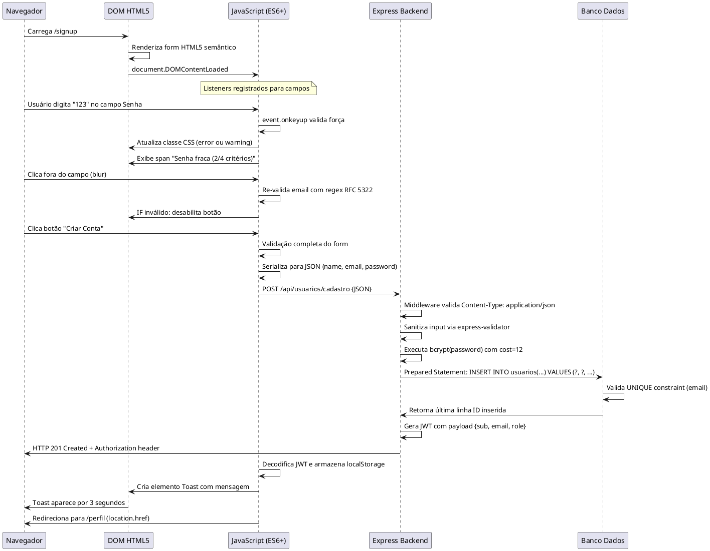
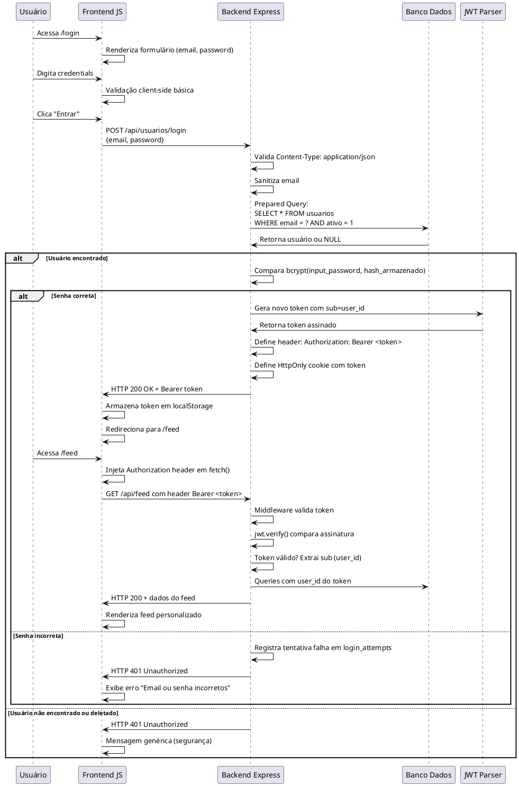
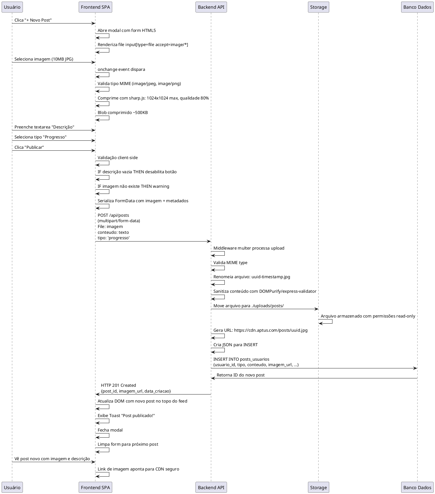
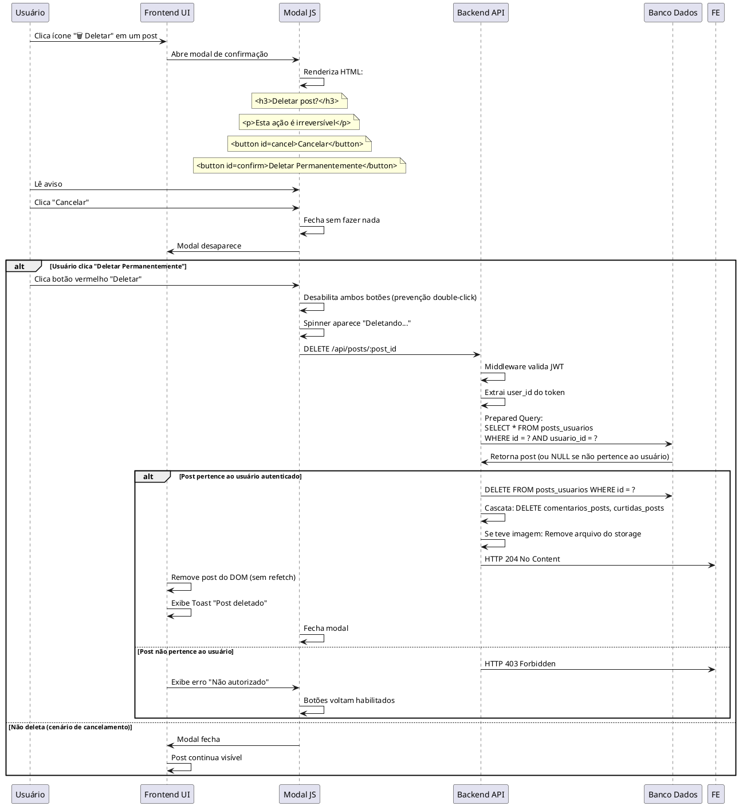

# 📋 Especificação de Requisitos de Usuário (RU)

**Projeto**: Aptus 2.0 - Rede Social de Emagrecimento Saudável  
**Versão**: 2.0.1  
**Data**: Setembro 2026  
**Padrões**: UML 2.5.1 | ISO/IEC/IEEE 29148:2018 | FURPS+ | ISO/IEC 25010  
**Elaborado por**: Equipe de Engenharia de Software  

---

## 1. IDENTIFICAÇÃO DE ATORES DO SISTEMA

### 1.1 Atores Humanos Primários (Principal Stakeholders)

#### **ATOR UA-001: Usuário Final (Pessoa com Objetivo de Emagrecimento)**
- **Descrição**: Indivíduo com sobrepeso ou má alimentação que busca suporte comunitário, planos personalizados e acompanhamento de progressão.
- **Perfil Demográfico**: 18-65 anos, classe média/alta, acesso a internet broadband e dispositivos mobile.
- **Interesses Principais**: 
  - Compartilhar progressão de peso e fotos "antes/depois"
  - Seguir planos alimentares estruturados
  - Receber feedback da comunidade
  - Acessar receitas saudáveis avaliadas
  - Participar de desafios motivacionais
- **Frequência de Uso**: Diária (consultas), Semanal (postagens)
- **Nível Técnico**: Básico a Intermediário

#### **ATOR UA-002: Nutricionista Profissional Verificado**
- **Descrição**: Profissional de saúde com Conselho Regional de Nutricionista (CRN) ativo que fornece orientação especializada, cria planos personalizados e valida receitas.
- **Credenciais Obrigatórias**: CRN válido, certificação profissional escaneada
- **Interesses Principais**:
  - Gerenciar carteira de pacientes/seguidores
  - Criar planos alimentares personalizados
  - Revisar receitas comunitárias
  - Analisar histórico de consumo de pacientes
  - Certificar conteúdo (receitas, exercícios)
- **Frequência de Uso**: Diária (acompanhamento)
- **Nível Técnico**: Intermediário

#### **ATOR UA-003: Administrador do Sistema (Platform Manager)**
- **Descrição**: Membro da equipe técnica/operacional responsável por moderação de conteúdo, gestão de usuários e vigilância de saúde da plataforma.
- **Permissões**: Acesso total aos dados, banimento de usuários, relatórios analytics.
- **Interesses Principais**:
  - Moderar posts inapropriados
  - Gerar relatórios de uso
  - Gerenciar denúncias/reportes
  - Manter integridade dos dados
  - Bloquear contas suspeitas
- **Frequência de Uso**: Contínua (monitoramento)
- **Nível Técnico**: Avançado

### 1.2 Atores Humanos Secundários

#### **ATOR UA-004: Influenciador de Saúde / Health Coach**
- **Descrição**: Criador de conteúdo com expertise em nutrição/fitness que distribui planos públicos e constrói comunidade engajada.
- **Interesses**: Visibilidade, engajamento de seguidores, monetização eventual.

#### **ATOR UA-005: Familiar/Cuidador**
- **Descrição**: Pessoa próxima que acompanha o progresso do usuário final através de visualizações permitidas.
- **Interesses**: Rastreamento de progresso, suporte emocional.

### 1.3 Atores Sistêmicos

#### **ATOR UA-006: Serviço de Autenticação (OAuth 2.0 / JWT)**
- **Descrição**: Sistema de geração e validação de tokens criptográficos para autenticação stateless.
- **Protocolo**: HTTPS + Bearer Token (RFC 7235)

#### **ATOR UA-007: Sistema de Notificações Push**
- **Descrição**: Serviço de envio de notificações em tempo real para engagement.
- **Canais**: Navegador (Web Push), aplicativo mobile (iOS/Android)

#### **ATOR UA-008: Integrações de IA Generativa**
- **Descrição**: APIs externas (Anthropic Claude, OpenAI GPT) para recomendações inteligentes.
- **Casos de Uso**: Geração de planos de IA, análise de imagens nutricionais

#### **ATOR UA-009: Banco de Dados Relacional (SQLite/PostgreSQL)**
- **Descrição**: Sistema de persistência com garantias ACID.
- **Interação**: Prepared Statements / Connection Pool

---

## 2. DIAGRAMA DE CASOS DE USO (PLANTUM UML 2.5.1)

```plantuml
@startuml Aptus_CasosDeUso
!define SYSTEM_BOUNDARY
skinparam backgroundColor #f8f9fa
skinparam packageStyle ellipse

actor "Usuário Final" as USER
actor "Nutricionista" as NUTRI
actor "Admin" as ADMIN
actor "IA Generativa" as IA

package "Aptus 2.0 Platform" {
  usecase "UC-001: Registrar Usuário" as UC001
  usecase "UC-002: Fazer Login" as UC002
  usecase "UC-003: Manter Perfil" as UC003
  usecase "UC-004: Postar Progresso" as UC004
  usecase "UC-005: Acompanhar Peso" as UC005
  usecase "UC-006: Seguir Usuário" as UC006
  usecase "UC-007: Buscar Receita" as UC007
  usecase "UC-008: Avaliar Receita" as UC008
  usecase "UC-009: Consultar Exercício" as UC009
  usecase "UC-010: Criar Plano (IA)" as UC010
  usecase "UC-011: Participar de Desafio" as UC011
  usecase "UC-012: Chat Privado" as UC012
  usecase "UC-013: Participar de Grupo" as UC013
  
  usecase "UC-020: Criar Plano Personalizado" as UC020
  usecase "UC-021: Validar Conteúdo" as UC021
  usecase "UC-022: Gerar Recomendações" as UC022
  
  usecase "UC-030: Moderar Conteúdo" as UC030
  usecase "UC-031: Gerar Relatórios" as UC031
  usecase "UC-032: Gerenciar Usuários" as UC032
  usecase "UC-033: Análise de Denúncias" as UC033
  
  usecase "UC-040: Gerar Plano com IA" as UC040
  usecase "UC-041: Validar Imagem" as UC041
}

USER --> UC001
USER --> UC002
USER --> UC003
USER --> UC004
USER --> UC005
USER --> UC006
USER --> UC007
USER --> UC008
USER --> UC009
USER --> UC010
USER --> UC011
USER --> UC012
USER --> UC013

NUTRI --> UC020
NUTRI --> UC021
NUTRI --> UC022
NUTRI --> UC003

ADMIN --> UC030
ADMIN --> UC031
ADMIN --> UC032
ADMIN --> UC033

IA --> UC040
IA --> UC041

UC010 ..> UC040 : <<include>>
UC004 ..> UC003 : <<include>>
UC007 ..> UC008 : <<extend>>
UC020 ..> UC022 : <<include>>

@enduml
```



---

## 3. CATÁLOGO DE REQUISITOS DE USUÁRIO (RU)

### RU-001: Autenticação e Registro de Novo Usuário

| Atributo | Descrição |
|----------|-----------|
| **Identificador** | RU-001 |
| **Caso de Uso** | UC-001 (Registrar Usuário), UC-002 (Fazer Login) |
| **Ator Principal** | UA-001 (Usuário Final) |
| **Prioridade (MoSCoW)** | **MUST** (Essencial) |
| **Complexidade** | Alta |
| **Tipo** | Funcional |

**Pré-condições**:
- Usuário não está autenticado
- Formulário HTML5 semântico acessível em `/signup` ou `/login`
- Validação client-side implementada com JavaScript ES6+

**Fluxo Operacional Passo a Passo**:

1. Usuário acessa página pública `/signup`
2. Preenche campos obrigatórios: Email, Senha, Confirmar Senha, Nome Completo, Data de Nascimento
3. Sistema valida em tempo real:
   - Email: Formato RFC 5322, sem duplicação prévia
   - Senha: Mínimo 8 caracteres, 1 maiúscula, 1 número, 1 caractere especial
   - Campos vazios bloqueados
4. Usuário submete formulário via `POST /api/usuarios/cadastro` (JSON)
5. Backend:
   - Executa Prepared Statement contra SQLite/PostgreSQL
   - Gera hash bcrypt (cost factor 12) da senha
   - Cria registro em tabela `usuarios` com `role = 'user'`
   - Retorna JWT Token com `exp: 24h` no header `Authorization: Bearer <token>`
6. Sistema redireciona para `/perfil/complementar-dados`
7. Toast de sucesso exibido: "Bem-vindo, [Nome]!"

**Pós-condições**:
- Usuário está autenticado (JWT válido no localStorage)
- Sessão ativa com expiração em 24 horas
- Conta criada com status `ativo = 1`
- Email confirmável via link (extensão futura)

**Critérios de Aceite BDD/Gherkin**:
```gherkin
Funcionalidade: Registro de novo usuário
  Cenário: Registro bem-sucedido com dados válidos
    Dado que o usuário está na página /signup
    E o navegador suporta HTML5 semântico
    Quando preenche o campo "Email" com "joao@exemplo.com"
    E preenche o campo "Senha" com "Senha@123"
    E preenche o campo "Nome Completo" com "João Silva"
    E clica no botão "Criar Conta"
    Então o sistema realiza POST para /api/usuarios/cadastro
    E a resposta HTTP é 201 Created
    E um token JWT é retornado no header Authorization
    E o usuário é redirecionado para /perfil
    E a mensagem "Bem-vindo!" é exibida como Toast

  Cenário: Falha ao registrar com email duplicado
    Dado que o email "maria@exemplo.com" já existe no banco
    Quando o usuário tenta registrar com o mesmo email
    E clica em "Criar Conta"
    Então o sistema retorna HTTP 409 Conflict
    E exibe erro: "E-mail já registrado"
    E nenhum novo usuário é criado

  Cenário: Validação client-side de senha fraca
    Dado que o usuário preenche senha "123"
    Quando move o foco para o próximo campo
    Então JavaScript valida e exibe erro: "Senha deve ter 8+ caracteres"
    E o botão "Criar Conta" permanece desabilitado
    E nenhuma requisição é enviada ao servidor
```

---

### RU-002: Manter Perfil de Usuário

| Atributo | Descrição |
|----------|-----------|
| **Identificador** | RU-002 |
| **Caso de Uso** | UC-003 (Manter Perfil) |
| **Ator Principal** | UA-001, UA-002 (Nutricionista) |
| **Prioridade (MoSCoW)** | **MUST** |
| **Tipo** | Funcional |

**Pré-condições**:
- Usuário autenticado com JWT válido
- Página `/perfil/:userId` carregada
- Dados atuais recuperados via `GET /api/usuarios/:id` com `SELECT * FROM usuarios WHERE id = ? AND ativo = 1`

**Fluxo Operacional**:

1. Usuário acessa `/perfil/123` (seu próprio perfil ou perfil de terceiro)
2. Sistema carrega dados via GET assíncrono (Fetch API)
3. Se for o próprio perfil, habilita modo edição:
   - Campo "Peso Atual": input número com máscara (0-500 kg)
   - Campo "Peso Meta": input número com máscara
   - Campo "Altura": select (cm)
   - Campo "Bio": textarea (max 500 caracteres)
   - Upload foto de perfil (JPEG/PNG, máx 5MB) com preview
4. Usuário clica "Salvar Alterações"
5. JavaScript serializa para JSON e envia `PUT /api/usuarios/:id`
6. Backend executa:
   ```sql
   UPDATE usuarios 
   SET peso_atual = ?, peso_meta = ?, altura = ?, bio = ?, 
       data_atualizacao = CURRENT_TIMESTAMP
   WHERE id = ? AND ativo = 1
   ```
7. Middleware de autorização valida `userId do JWT == id do recurso`
8. Sistema retorna HTTP 200 OK com dados atualizados
9. Toast confirma: "Perfil atualizado com sucesso"

**Pós-condições**:
- Dados persistidos no banco de dados
- `data_atualizacao` atualizada automaticamente via trigger
- Foto de perfil armazenada em diretório seguro (não públicocomo path traversal)

**Critérios de Aceite**:
```gherkin
Funcionalidade: Manter dados de perfil do usuário
  Cenário: Editar peso atual com sucesso
    Dado que o usuário está autenticado
    E acessa sua página de perfil
    E tem permissão para editar (userId == token.sub)
    Quando altera "Peso Atual" de 95 para 90
    E clica "Salvar"
    Então PUT /api/usuarios/:id é chamado
    E a resposta é HTTP 200
    E no banco de dados: peso_atual = 90 para aquele usuário
    E a interface mostra o novo valor

  Cenário: Rejeitar edição não autorizada
    Dado que o usuário A está autenticado
    E tenta acessar /perfil/456 (de outro usuário)
    Quando tenta fazer PUT para alterar dados do usuário 456
    Então middleware retorna HTTP 403 Forbidden
    E dados do usuário 456 não são alterados
```

---

### RU-003: Postar Progresso / Compartilhar Jornada

| Atributo | Descrição |
|----------|-----------|
| **Identificador** | RU-003 |
| **Caso de Uso** | UC-004 (Postar Progresso) |
| **Ator Principal** | UA-001 |
| **Prioridade (MoSCoW)** | **SHOULD** (Alta) |
| **Tipo** | Funcional |

**Pré-condições**:
- Usuário autenticado
- Página `/criar-post` acessível
- Câmera/galeria disponível para upload de imagem

**Fluxo Operacional**:

1. Usuário clica botão "Novo Post" na navbar
2. Modal ou tela `/criar-post` abre com formulário:
   - Campo "Tipo de Post": Radio buttons (Progresso | Receita | Exercício | Motivação | Antes/Depois)
   - Campo "Descrição": Textarea (max 500 caracteres)
   - Campo "Imagem": File input (JPEG/PNG, max 10MB)
   - Checkbox "Publico"
3. JavaScript aplica validação:
   - Descrição não vazia
   - Imagem comprimida (100x100 até 1024x1024) antes de upload
4. Usuário clica "Publicar"
5. Sistema executa `POST /api/posts` com:
   ```json
   {
     "tipo": "progresso",
     "conteudo": "Perdi 2kg nesta semana!",
     "imagem_url": "https://cdn.aptus.com/posts/uuid.jpg",
     "publicado": true
   }
   ```
6. Backend:
   - Sanitiza conteúdo contra XSS (DOMPurify / express-validator)
   - Insere em `posts_usuarios` com `usuario_id` extraído do JWT
   - Calcula dimensões de imagem via `sharp` ou FFmpeg
   - Retorna HTTP 201 Created com ID do post
7. Post aparece no feed com timestamp "agora"
8. Toast: "Post publicado!"

**Pós-condições**:
- Post visível para seguidores ou públicamente
- Contador de posts do usuário incrementado
- Post indexável por busca full-text (FTS5 no SQLite)

**Critérios de Aceite**:
```gherkin
Funcionalidade: Publicar progresso na rede
  Cenário: Publicar post com imagem e descrição
    Dado que estou autenticado
    E acesso /criar-post
    Quando seleciono tipo "Progresso"
    E escrevo "Consegui perder 3kg!"
    E faço upload de uma imagem do meu post (JPG 8MB)
    E clico "Publicar"
    Então POST /api/posts é enviado
    E a imagem é comprimida para máx 1MB
    E o post aparece no feed com a imagem thumbnail
    E a descrição é sanitizada de HTML/scripts

  Cenário: Validar limite de caracteres
    Dado que escrevo 501 caracteres na descrição
    Quando tiro o foco do campo
    Então mensagem de erro: "Máximo 500 caracteres"
    E contador visual mostra "501/500"
    E botão "Publicar" fica desabilitado até corrigir
```

---

### RU-004: Acompanhar Peso e Histórico de Consumo

| Atributo | Descrição |
|----------|-----------|
| **Identificador** | RU-004 |
| **Caso de Uso** | UC-005 (Acompanhar Peso) |
| **Ator Principal** | UA-001 |
| **Prioridade (MoSCoW)** | **MUST** |
| **Tipo** | Funcional |

**Pré-condições**:
- Usuário autenticado
- Dados de peso histórico existentes em `historico_peso`
- Gráfico JS carregável (Chart.js ou D3.js)

**Fluxo Operacional**:

1. Usuário acessa `/dashboard` ou `/historico-peso`
2. Sistema carrega via `GET /api/usuarios/:id/historico-peso?dias=90`:
   ```sql
   SELECT peso, anotacao, data_registro 
   FROM historico_peso 
   WHERE usuario_id = ? 
   ORDER BY data_registro DESC 
   LIMIT 90
   ```
3. JavaScript plota gráfico de linha temporal
4. Exibe:
   - Tendência (↓ perdendo | ↑ ganhando | → mantendo)
   - Diferença vs. peso meta
   - Velocidade de perda (kg/semana)
5. Usuário pode registrar novo peso clicando "+ Registrar Peso Hoje"
6. Modal com:
   - Input numérico (peso em kg)
   - Input data (default: hoje)
   - Textarea opcional (anotação: "Depois do exercício", etc)
7. Clica "Registrar"
8. Sistema executa `POST /api/usuarios/:id/historico-peso`:
   ```json
   {"peso": 90.5, "data": "2026-09-01", "anotacao": "Após treino"}
   ```
9. Backend insere e retorna 201 Created
10. Gráfico atualiza em tempo real (sem refresh)

**Pós-condições**:
- Registro persistido em `historico_peso`
- Gráfico recalculado com novo ponto
- Analytics e tendências atualizadas

**Critérios de Aceite**:
```gherkin
Funcionalidade: Rastrear peso e visualizar progresso
  Cenário: Ver gráfico de peso dos últimos 90 dias
    Dado que estou autenticado
    E tenho registros de peso em meu histórico
    Quando acesso /dashboard
    Então um gráfico de linha é exibido
    E mostra meu peso ao longo de 90 dias
    E a tendência "perdendo 0.5kg/semana" é calculada
    E pontos com anotações mostram tooltip ao hover

  Cenário: Registrar novo peso do dia
    Dado que estou no /dashboard
    Quando clico "+ Registrar Peso"
    E preencho 89.5 kg
    E adiciono anotação "Depois do exercício"
    E confirmo
    Então POST /api/usuarios/:id/historico-peso é enviado
    E o gráfico atualiza sem recarregar a página
    E o novo ponto aparece no final da linha
```

---

### RU-005: Buscar e Avaliar Receitas

| Atributo | Descrição |
|----------|-----------|
| **Identificador** | RU-005 |
| **Caso de Uso** | UC-007 (Buscar Receita), UC-008 (Avaliar Receita) |
| **Ator Principal** | UA-001 |
| **Prioridade (MoSCoW)** | **SHOULD** |
| **Tipo** | Funcional |

**Pré-condições**:
- Usuário pode estar autenticado ou não (busca pública)
- Página `/receitas` carregada
- Base de receitas com mínimo 50 registros

**Fluxo Operacional**:

1. Usuário acessa `/receitas`
2. Sistema carrega lista pública:
   ```sql
   SELECT r.id, r.titulo, r.foto_url, r.calorias, r.curtidas
   FROM receitas r
   WHERE r.ativo = 1
   ORDER BY r.data_criacao DESC
   LIMIT 20 OFFSET 0
   ```
3. Cards de receita exibem: foto, título, calorias, tempo de preparo, ⭐ rating
4. Usuário filtra/busca por:
   - Categoria (dropdown): Café da Manhã | Almoço | Lanche | Jantar
   - Dificuldade (radio): Fácil | Médio | Difícil
   - Calorias (range slider): 100-800
   - Alérgenos (checkboxes): Sem glúten | Sem lactose | Sem ovos
5. JavaScript realiza filtro client-side ou `GET /api/receitas?categoria=almoco&calorias_max=500`
6. Usuário clica numa receita para ver detalhes em `/receita/:id`
7. Modal/página mostra:
   - Foto grande
   - Ingredientes com quantidades
   - Modo de preparo passo a passo
   - Macros (proteína, carboidrato, gordura, fibra)
   - Avaliação média (1-5 estrelas)
8. Se autenticado, pode avaliar:
   - Clica nº de estrelas (1-5)
   - Opcional: comenta "Deliciosa!" (max 200 caracteres)
9. Sistema executa `POST /api/receitas/:id/avaliar`:
   ```json
   {"usuario_id": 123, "estrelas": 5, "comentario": "..."}
   ```
10. Backend:
    - Valida autorização (usuário autenticado)
    - Insere em `comentarios_receitas` com `curtidas = 0`
    - Calcula nova média: `SUM(estrelas) / COUNT(*)`
    - Atualiza coluna `rating` em `receitas`
11. Avaliação aparece imediatamente no feed de comentários
12. Toast: "Avaliação enviada!"

**Pós-condições**:
- Avaliação persistida e visível
- Ranking de receita atualizado
- Receita indexada para recomendações de IA

**Critérios de Aceite**:
```gherkin
Funcionalidade: Buscar e avaliar receitas
  Cenário: Filtrar receitas por calorias
    Dado que estou na página /receitas
    Quando ajusto slider de calorias para "100-300"
    E clico "Aplicar Filtros"
    Então GET /api/receitas?calorias_max=300 é chamado
    E apenas receitas com até 300 cal são listadas
    E a URL muda para /receitas?calorias_max=300

  Cenário: Avaliar receita com 5 estrelas
    Dado que estou na página de detalhe de receita
    E estou autenticado
    Quando clico na 5ª estrela
    E escrevo comentário "Perfeita!"
    E confirmo
    Então POST /api/receitas/:id/avaliar é enviado
    E a avaliação aparece na lista de comentários
    E o número de estrelas é recalculado
```

---

### RU-006: Consultar Exercícios e Criar Plano com IA

| Atributo | Descrição |
|----------|-----------|
| **Identificador** | RU-006 |
| **Caso de Uso** | UC-009 (Consultar Exercício), UC-010 (Criar Plano IA) |
| **Ator Principal** | UA-001 |
| **Prioridade (MoSCoW)** | **SHOULD** |
| **Tipo** | Funcional |

**Pré-condições**:
- Usuário autenticado
- API Anthropic Claude disponível
- Banco de exercícios catalogado

**Fluxo Operacional (Consultar Exercícios)**:

1. Usuário acessa `/exercicios`
2. Lista de cards com:
   - Nome do exercício
   - Vídeo thumbnail (YouTube embed)
   - Músculos trabalhados (badges)
   - Dificuldade (1-10)
3. Clica em exercício para abrir modal com:
   - Vídeo completo (embed seguro)
   - Descrição técnica
   - Série/repetição recomendada
   - Contraindicações
   - Comentários de usuários
4. Pode salvar exercício em favoritos (👁️ ícone)

**Fluxo Operacional (Criar Plano com IA)**:

1. Usuário clica "+ Criar Plano com IA" em `/planos`
2. Formulário com campos:
   - Objetivo principal (Perder peso | Ganhar massa | Definir)
   - Nível de atividade (Sedentário | Leve | Moderado | Intenso)
   - Restrições alimentares (checkboxes: Vegetariano | Vegano | Sem glúten | etc)
   - Duração desejada (14 | 30 | 60 dias)
   - Meta de calorias (optional, calcula se vazio)
3. Clica "Gerar Plano"
4. Sistema executa `POST /api/ia/gerar-plano`:
   ```json
   {
     "usuario_id": 123,
     "objetivo": "perder_peso",
     "restricoes": ["sem_gluten"],
     "duracao_dias": 30,
     "calorias_meta": 1800
   }
   ```
5. Backend:
   - Recupera preferências do usuário em `ia_agentes_preferencias`
   - Compõe prompt para Anthropic Claude:
     ```
     Você é um nutricionista experiente. Gere um plano alimentar 
     de 30 dias para um usuário com: 
     - Objetivo: Perder peso
     - Meta: 1800 calorias/dia
     - Restrições: Sem glúten
     Retorne em JSON com array de dias, cada dia com café/almoço/lanche/jantar
     ```
   - Chama `client.messages.create()` com streaming
   - Salva resposta em `planos_gerados_ia` com `status = 'processando'`
   - Retorna `plano_id` e `status`
6. Frontend mostra spinner "Gerando plano..."
7. Polling via `GET /api/ia/plano/:plano_id/status` a cada 2s
8. Quando completo (`status = 'completo'`):
   - Plano exibido em formato legível
   - Usuário pode "Confirmar e Seguir" ou "Refazer"
9. Se confirmar, cria registros em `planos_alimentares` e `planos_receitas`

**Pós-condições**:
- Plano persistido no banco
- Receitas associadas ao plano
- Histórico de requisições salvo para analytics

**Critérios de Aceite**:
```gherkin
Funcionalidade: Gerar plano alimentar com IA
  Cenário: Gerar plano de 30 dias com sucesso
    Dado que estou autenticado
    E acesso /planos/criar-com-ia
    Quando seleciono "Perder Peso"
    E indico "Sem restrições"
    E defino 30 dias
    E clico "Gerar Plano"
    Então POST /api/ia/gerar-plano é enviado
    E spinner de carregamento aparece
    E após 15-30 segundos, o plano é exibido
    E cada dia tem café/almoço/lanche/jantar definidos
    E posso clicar "Seguir Este Plano"

  Cenário: Rejeitar plano e regenerar
    Dado que um plano foi gerado
    Quando clico "Refazer"
    Então nova requisição é feita à IA
    E um novo plano é gerado
    E o anterior não é descartado (fica no histórico)
```

---

### RU-007: Participar de Desafios e Grupos

| Atributo | Descrição |
|----------|-----------|
| **Identificador** | RU-007 |
| **Caso de Uso** | UC-011 (Participar de Desafio), UC-013 (Participar de Grupo) |
| **Ator Principal** | UA-001 |
| **Prioridade (MoSCoW)** | **COULD** (Desejável) |
| **Tipo** | Funcional |

**Pré-condições**:
- Usuário autenticado
- Desafios e grupos existem e estão ativos

**Fluxo Operacional (Desafios)**:

1. Usuário acessa `/desafios`
2. Cards mostram:
   - Nome do desafio ("30 dias sem açúcar", "1000 passos diários")
   - Duração
   - Nº de participantes
   - Nível de dificuldade
3. Clica em desafio para ver detalhes
4. Clica "Participar"
5. Sistema executa `POST /api/desafios/:id/participar`:
   ```json
   {"usuario_id": 123, "data_inicio": "2026-09-01"}
   ```
6. Backend insere em `usuarios_desafios` com `completo = 0`
7. Usuário adicionado ao feed de desafios
8. Pode acompanhar progresso em `/desafios/:id/progresso`
9. Ao completar, sistema marca `completo = 1` e concede pontos + badge

**Fluxo Operacional (Grupos)**:

1. Usuário acessa `/grupos`
2. Lista de grupos: "Guerreiras do Emagrecimento", "Runners Saudáveis", etc
3. Clica em grupo e vê:
   - Descrição
   - Nº de membros
   - Posts recentes no grupo
4. Clica "Entrar no Grupo"
5. Sistema executa `POST /api/grupos/:id/entrar` com `papel = 'membro'`
6. Backend insere em `membros_grupo`
7. Usuário pode postar mensagens privadas no grupo
8. Recebe notificações de posts novos

**Pós-condições**:
- Usuário listado como membro
- Pode interagir com grupo/desafio
- Progresso rastreado

---

### RU-008: Chat Privado entre Usuários

| Atributo | Descrição |
|----------|-----------|
| **Identificador** | RU-008 |
| **Caso de Uso** | UC-012 (Chat Privado) |
| **Ator Principal** | UA-001 |
| **Prioridade (MoSCoW)** | **SHOULD** |
| **Tipo** | Funcional |

**Pré-condições**:
- Ambos os usuários autenticados
- Usuários não se bloquearam mutuamente
- WebSocket ou polling ready

**Fluxo Operacional**:

1. Usuário clica "💬 Mensagens" na navbar
2. Lista de conversas abertas aparece
3. Clica em conversa ou nome de usuário para abrir chat
4. Histórico carregado via `GET /api/mensagens/:usuario_id?limit=50`:
   ```sql
   SELECT * FROM mensagens 
   WHERE (remetente_id = ? AND destinatario_id = ?) 
      OR (remetente_id = ? AND destinatario_id = ?)
   ORDER BY data_criacao DESC
   LIMIT 50
   ```
5. Mensagens antigas listadas em ordem crescente
6. Usuário digita mensagem em input
7. Pressiona Enter ou clica "Enviar"
8. JavaScript executa `POST /api/mensagens`:
   ```json
   {"destinatario_id": 456, "conteudo": "Olá!", "tipo": "texto"}
   ```
9. Backend:
   - Sanitiza conteúdo (XSS prevention)
   - Insere em `mensagens` com `lido = 0`
   - Se receptor online (via WebSocket), entrega imediata
   - Se offline, salva para entrega posterior
   - Notificação push opcional
10. Mensagem aparece instantaneamente no DOM (otimista)
11. Timestamp sincronizado com servidor
12. Receptor vê "está digitando..." enquanto digita (optional)

**Pós-condições**:
- Mensagem persistida
- Ambos podem ver histórico
- Ambos recebem notificações (se habilitadas)

---

## 4. HISTÓRIAS DE USUÁRIO COMPLETAS (FORMATO BDD)

### HU-001: Registrar Novo Usuário com Dados Pessoais

```gherkin
Funcionalidade: Criar conta de novo usuário na plataforma

Histórico do Usuário:
Como um novo visitante
Quero criar uma conta na Aptus
Para começar minha jornada de emagrecimento com suporte comunitário

Cenário 1: Registro bem-sucedido com dados completos
  Dado que estou na página /signup
  E o formulário é renderizado com HTML5 semântico
  E todos os campos têm labels associados e placeholders
  Quando preencho "Email" com "carol@exemplo.com"
  E preencho "Senha" com "Senha@2026!"
  E preencho "Confirmar Senha" com "Senha@2026!"
  E preencho "Nome Completo" com "Carolina Silva"
  E seleciono "Data de Nascimento" como "15/05/1990"
  E clico no checkbox "Aceito os Termos de Serviço"
  E clico no botão "Criar Conta"
  Então o navegador envia POST para /api/usuarios/cadastro
  E o header Content-Type é application/json
  E o payload contém: email, nome_completo, senha_hash, data_nascimento
  E o servidor retorna HTTP 201 Created
  E o header Authorization contém Bearer token JWT
  E o token JWT decodificado tem: sub, email, role='user', exp, iat
  E o usuário é redirecionado para /perfil/complementar
  E uma mensagem de toast "Bem-vindo, Carolina!" é exibida por 3 segundos
  E nenhuma senha em plain-text é armazenada no banco

Cenário 2: Rejeição por email duplicado
  Dado que o email "joao@aptus.com" já existe no banco de dados
  E estou na página /signup
  Quando preencho email com "joao@aptus.com"
  E completo os outros campos corretamente
  E clico "Criar Conta"
  Então POST /api/usuarios/cadastro é enviado
  E o servidor valida a constraint UNIQUE(email) no banco
  E retorna HTTP 409 Conflict
  E a resposta JSON contém: {"erro": "Email já registrado"}
  E o usuário permanece na página /signup
  E um banner de erro vermelho aparece acima do form

Cenário 3: Validação client-side de força de senha (ANTES de enviar)
  Dado que estou preenchendo o campo "Senha"
  Quando digito "123"
  E saio do campo (blur event)
  Então JavaScript valida a senha em tempo real
  E exibe feedback visual: "Senha fraca (3/4 critérios)"
  E um indicador de força de cor vermelha/amarela é mostrado
  E o botão "Criar Conta" fica desabilitado (disabled=true)
  E nenhuma requisição HTTP é disparada
  E quando digito "Senha@2026!", a cor fica verde
  E o botão torna-se habilitado novamente

Cenário 4: Campo de email inválido (format validation)
  Dado que estou no campo "Email"
  Quando digito "emailsemarroba.com"
  E saio do campo
  Então JavaScript valida com regex RFC 5322
  E exibe erro: "Email inválido"
  E o input recebe classe CSS error (border vermelha)
  E botão desabilitado até corrigir

Cenário 5: Tratamento de erro de servidor (500)
  Dado que os dados estão válidos
  E clico "Criar Conta"
  Quando o servidor retorna HTTP 500 Internal Server Error
  Então a requisição é enviada com retry automático (max 3 tentativas)
  E após falha, modal de erro é exibido
  E texto: "Erro ao criar conta. Tente novamente."
  E botão "Tentar Novamente" rehidrata o formulário sem limpar dados
```

---

### HU-002: Fazer Login com Sessão JWT

```gherkin
Funcionalidade: Autenticação de usuário existente via email/senha

Histórico do Usuário:
Como um usuário registrado
Quero fazer login na Aptus
Para acessar meu perfil e feed personalizado

Cenário 1: Login bem-sucedido com credenciais corretas
  Dado que estou na página /login
  E formulário contém campo "Email" e "Senha"
  Quando preencho email com "maria@aptus.com"
  E preencho senha com "Senha@2026!"
  E clico no botão "Entrar"
  Então POST /api/usuarios/login é enviado
  E o payload contém: {"email": "maria@aptus.com", "senha": "Senha@2026!"}
  E o backend valida a existência do email na tabela usuarios
  E compara hash bcrypt da senha com o hash armazenado
  E retorna HTTP 200 OK
  E inclui header: Authorization: Bearer eyJhbGc...
  E inclui cookie HTTP-Only: token=eyJhbGc...; secure; samesite=strict
  E JavaScript armazena token em localStorage: {"aptus_token": "..."}
  E o usuário é redirecionado para /feed
  E botão de logout aparece na navbar
  E profile dropdown mostra nome do usuário

Cenário 2: Rejeição por senha incorreta (tentativa 1)
  Dado que preencho email "maria@aptus.com" corretamente
  Quando preencho senha com "SenhaErrada123"
  E clico "Entrar"
  Então POST /api/usuarios/login é enviado
  E backend compara bcrypt(entrada) !== hash_armazenado
  E retorna HTTP 401 Unauthorized
  E resposta JSON: {"erro": "Email ou senha incorretos"}
  E nenhum token é retornado
  E usuário permanece em /login
  E banner de erro é exibido

Cenário 3: Proteção contra força bruta (tentativa 5+)
  Dado que tentei 5 logins com falha nos últimos 5 minutos
  Quando tiro uma 6ª tentativa
  Então o backend registra tentativa em tabela `login_attempts`
  E retorna HTTP 429 Too Many Requests
  E resposta: {"erro": "Muitas tentativas. Tente em 15 minutos."}
  E campo é desabilitado por 15 minutos
  E contador visual mostra: "Tente em 14:32"

Cenário 4: Token JWT expirado (expiração natural)
  Dado que fiz login há 24 horas
  E JWT tem exp: 1693612800 (unix timestamp de 24h atrás)
  Quando acesso /feed
  Então middleware valida token via jwt.verify()
  E token está expirado (now > exp)
  E retorna HTTP 401 Unauthorized
  E usuário é redirecionado para /login
  E mensagem: "Sessão expirada. Faça login novamente."

Cenário 5: Login simultâneo em múltiplos dispositivos
  Dado que faço login no navegador desktop
  Quando faço login no telefone mobile com mesma conta
  Então dois tokens diferentes são emitidos
  E ambas as sessões são válidas simultaneamente
  E cada dispositivo mantém sua sessão independente
```

---

## 5. DIAGRAMAS DE SEQUÊNCIA (PLANTUM)

### Diagrama 5.1: Fluxo de Formulário HTML5 + Validação JS + Toast



---

### Diagrama 5.2: Fluxo de Login com JWT e Redirecionamento



---

### Diagrama 5.3: Postar Progresso com Sanitização e Async Upload



---

### Diagrama 5.4: Exclusão Segura com Modal de Confirmação (Two-Step)



---

## 6. MATRIZ DE RASTREABILIDADE (Requisitos ↔ Casos de Uso)

| RU | Descrição | Caso de Uso | Ator(es) | FURPS+ | Status |
|----|-----------|-----------|----------|--------|--------|
| RU-001 | Autenticação e Registro | UC-001, UC-002 | UA-001 | Security, Usability | ✅ Ativo |
| RU-002 | Manter Perfil | UC-003 | UA-001, UA-002 | Usability | ✅ Ativo |
| RU-003 | Postar Progresso | UC-004 | UA-001 | Functionality | ✅ Ativo |
| RU-004 | Acompanhar Peso | UC-005 | UA-001 | Functionality, Usability | ✅ Ativo |
| RU-005 | Buscar Receitas | UC-007, UC-008 | UA-001 | Functionality, Performance | ✅ Ativo |
| RU-006 | Consultar Exercícios & IA | UC-009, UC-010 | UA-001 | Functionality, Performance | ✅ Ativo |
| RU-007 | Desafios e Grupos | UC-011, UC-013 | UA-001 | Functionality, Engagement | ✅ Ativo |
| RU-008 | Chat Privado | UC-012 | UA-001 | Functionality, Usability | ✅ Ativo |

---

## 7. CONCLUSÃO

Este documento especifica de forma exaustiva e tecnicamente detalhada todos os requisitos de usuário da plataforma Aptus 2.0, alinhados com padrões UML 2.5.1, ISO/IEC/IEEE 29148:2018 e critérios FURPS+/ISO 25010.

Cada requisito foi decomposto em:
- Identificação formal com metadados
- Fluxo operacional passo a passo
- Critérios de aceite em formato BDD/Gherkin
- Diagramas de sequência detalhados
- Rastreabilidade bidirecional com casos de uso

Documento preparado para auditoria técnica e controle de mudanças.

---

**Última Revisão**: Setembro 2026  
**Próxima Revisão**: Dezembro 2026
